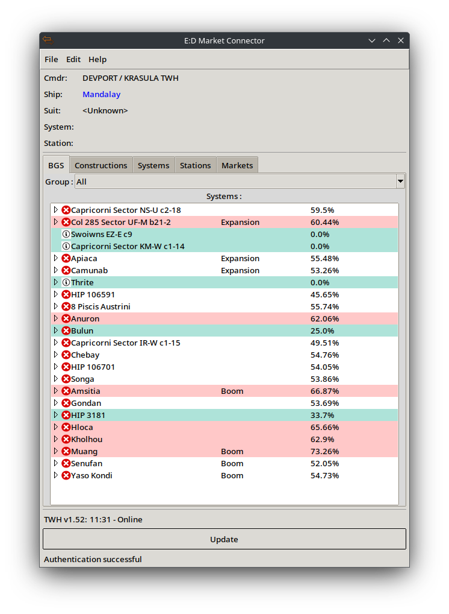

Próba zrobienia pluginu wspomagającego grę w Elite Dangerous.

Uwaga ! 
Nie jestem zawodowym programistą. Ale dla przyjemności czasami programuję po swojemu.

Wersja alpha 0.2

Co zostało zrobione:

W Plik/Ustawienia:
- możliwość zmiany kolorów na liście w zakładce BGS

Systemy:
- Tworzenie grup systemów
- wykrywanie systemu w którym się znajdujemy
- zapisywanie systemow do bazy lokalnej

BGS:
- Obecnie tylko wczytuje frakcje w systemie i wyświetla je na liście
- Są zdefiniowane 3 kolory (high, low, faction)
* high (czerwony) dla frakcji/systemu którego wpływy przekroczą 60 %
* low (fioletowy) dla frakcji/systemu którego wpływy spadną poniżej 40 %
* faction(zielonkawy) dla frakcji/systemu gracza
- wszelkie dane są aktualizowane w momencie zakończenia skoku do systemu
- ! podwójne kliknięcie myszką zapisuje do schowka nazwę systemu/frakcji z listy

Konstrukcje:
- wybór systemu zawierającego obiekty konstrukcyjne (grupowanie obiektów)
- wybór obiektu i marketu do podglądu
- Każde zadokowanie na obiekcie aktualizuje listę materiałów na tym obiekcie o ile został on zapisany 
- każde zadokowanie na obiekcie niezapisanym umożliwia jego podgląd bez konieczności zapisu
- aby dodać rynek (Stacji lub FleetCarrier'a) należy wejść do marketu w grze
- możliwość pokazywania tylko materiałów brakujacych na obiekcie

Rynki:
- Dodawanie, usuwanie rynkow z lokalnej bazy danych
- Podglad towarow na rynkach i w ładowni statku

Co do zrobienia w dalszej przyszłości:
- refaktoryzacja kodu
- poprwaianie znanych błędów
- tryb online umożliwiający współdzielenie danych o obiektach, systemach
* każde dokowanie CMDR'a na obiekcie odświeży listę u innych posiadajacych ten obiekt w swojej wtyczce
* notatnik i możliwość jego udostępniania innym CMDR.
* wystawianie alertów dla innych CMDR'ów, aby pomogli w np. ustabilizowaniu wpływów w systemie

Wtyczka może zawierać błędy.

