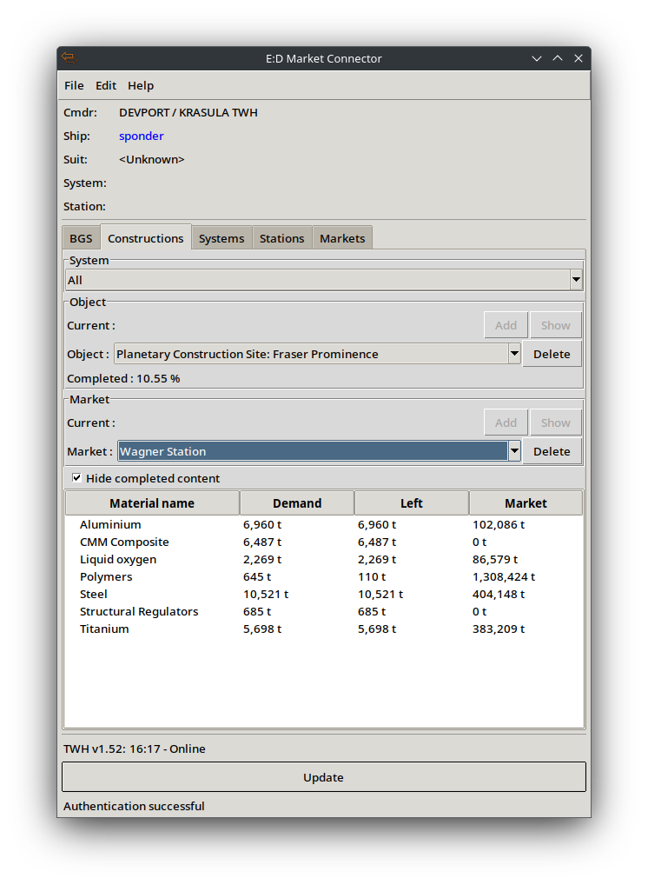
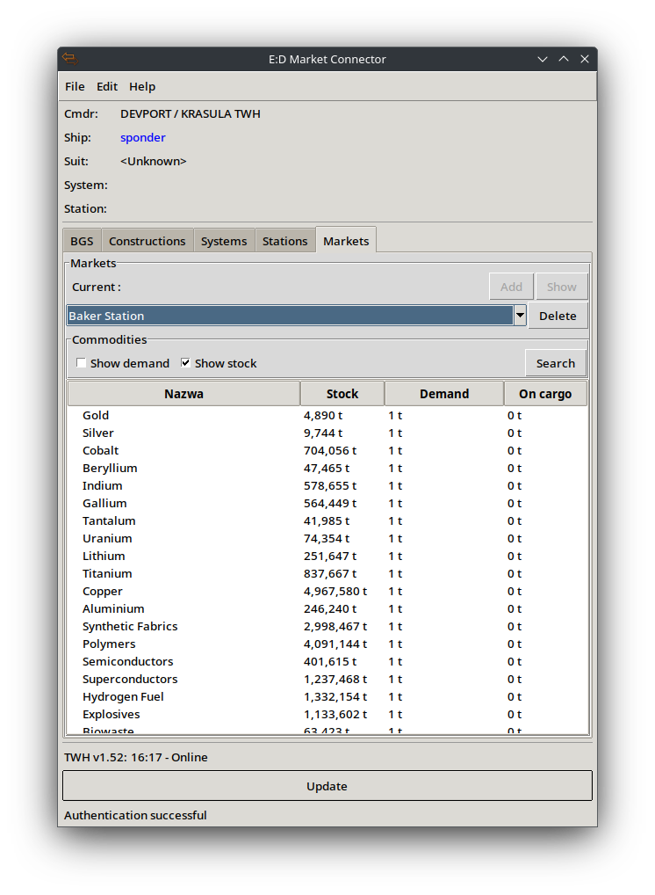
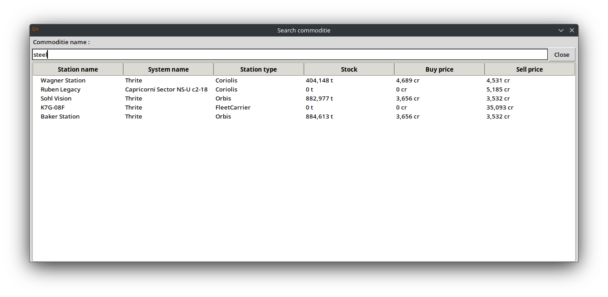

An attempt to create a plugin to support gameplay in Elite Dangerous.

Warning!
I’m not a professional programmer. But I sometimes code for fun, in my own way.

Alpha version 0.2

What has been done:

In File/Settings:
- Ability to change colors in the list under the BGS tab

Systems:
- Creating system groups
- Detecting the system the player is currently in
- Saving systems to a local database

BGS:
- Currently only loads factions in the system and displays them in a list
- Three colors are defined (high, low, faction):
  * high (red) – for factions/systems with influence over 60%
  * low (purple) – for factions/systems with influence below 40%
  * faction (greenish) – for the player's faction/system
- All data is updated when a jump to a system is completed
- Double-clicking an item in the list copies the system/faction name to the clipboard

Constructions:
- Selecting a system containing construction objects (grouping objects)
- Selecting an object and market for preview
- Every docking at an object updates the materials list on that object (if it's saved)
- Docking at an unsaved object allows preview without saving
- To add a market (Station or FleetCarrier), you need to enter the market in the game
- Option to show only missing materials on an object

Markets:
- Adding and removing markets from the local database
- Viewing goods in markets and in the ship's cargo
- Option to search for goods in saved markets

To be done in the future:
- Code refactoring
- Fixing known bugs
- Online mode to enable sharing data about objects and systems
  * Every CMDR's docking at an object updates the list for others who have that object in their plugin
  * Notepad and the ability to share notes with other CMDRs
  * Sending alerts to other CMDRs to help, e.g., stabilize influence in a system

The plugin may contain bugs.

